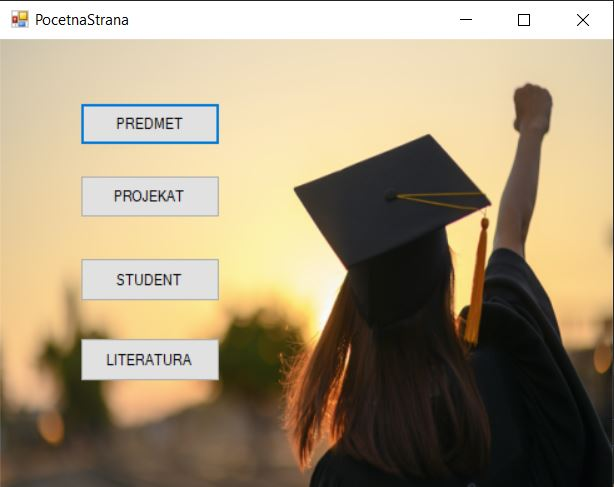
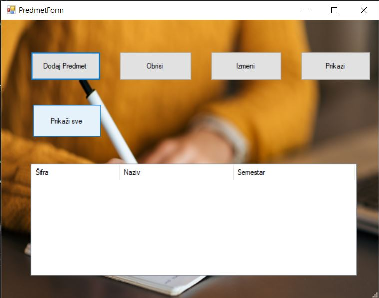

## Početna stranica aplikacije

### Prikaz nekih od glavnih entiteta

### Opis projekta

Ovaj projekat je razvijen za upravljanje studentskim projektima koristeći C# i Fluent NHibernate za ORM (Object-Relational Mapping). Aplikacija omogućava dodavanje, pregled i upravljanje podacima o autorima literature putem Windows Forms interfejsa.

